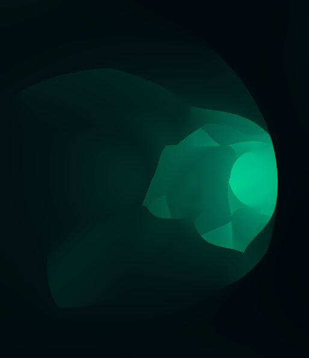
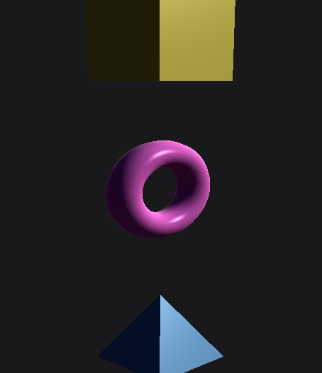

# OpenGL Shader Experiments
-3D renderer and shader viewer made with C++ and OpenGL / SDL  
-following tutorials and experimenting with GLSL shaders  
-additional libs: glm, assimp, imgui    

<table cellspacing="0" cellpadding="0">
  <tr>
    <td></td>
    <td></td>
    <td></td>
  </tr>
    <td></td>
    <td></td>
    <td></td>
  <tr>
  </tr>
  <tr>
    <td></td>
    <td></td>
    <td></td>
  </tr>
</table>